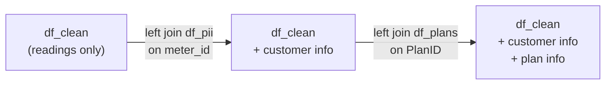
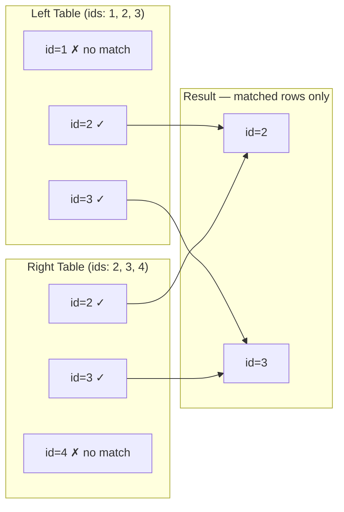
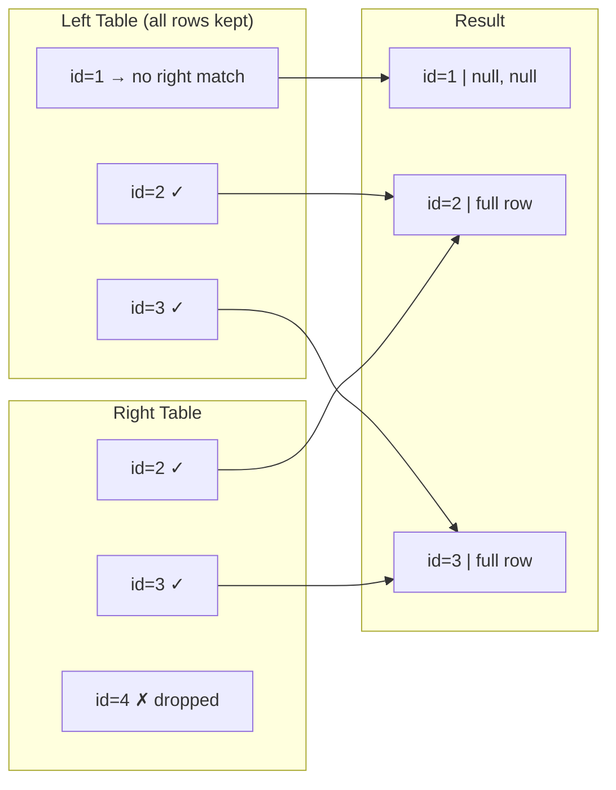
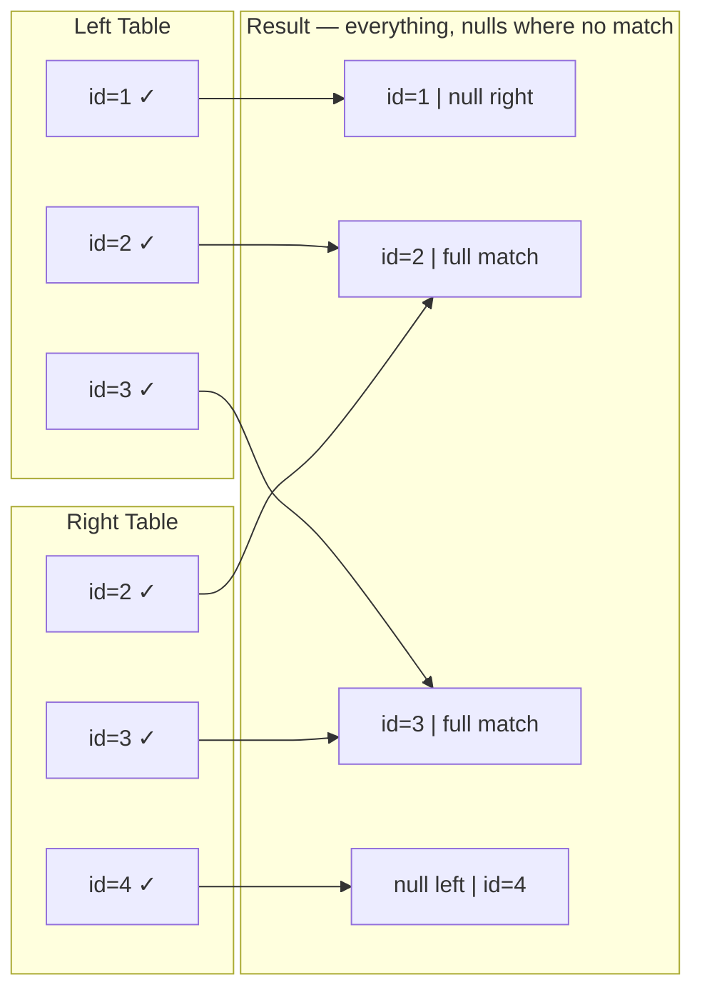
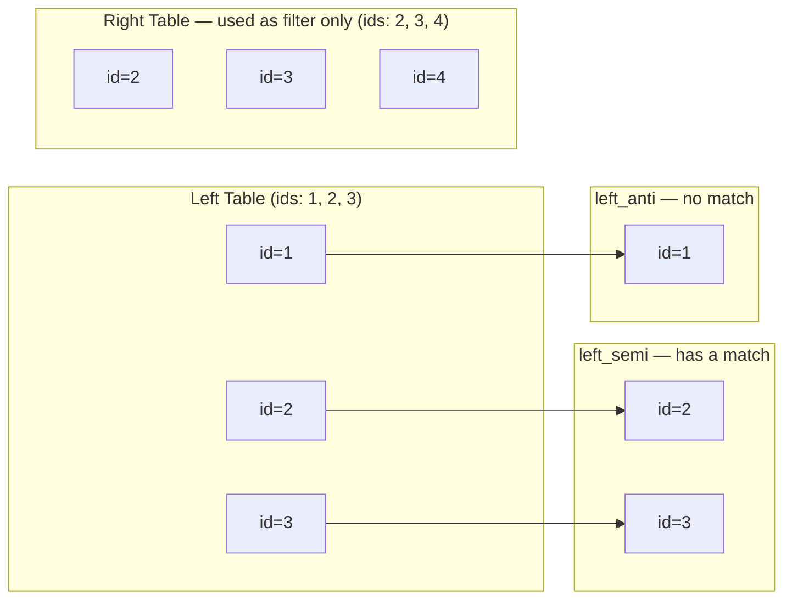

# Joins in PySpark

## Good news: you already know this

If you know SQL JOINs, you already understand PySpark joins. The logic is identical. The only thing that changes is how you write it.

```sql
-- SQL
SELECT *
FROM clean_readings r
LEFT JOIN customer_pii p ON r.meter_id = p.MeterID
LEFT JOIN pricing_plans pl ON p.PlanID = pl.PlanID
```

```python
# PySpark — same join, different syntax
df_joined = df_clean \
    .join(df_pii,   df_clean.meter_id == df_pii.MeterID,   "left") \
    .join(df_plans, df_pii.PlanID     == df_plans.PlanID,  "left")
```

Same result. Different shape.

---

## Join syntax breakdown

```python
df_result = df_left.join(df_right, join_condition, join_type)
```

| Part | Example | What it is |
|------|---------|------------|
| `df_left` | `df_clean` | Your primary table (like the FROM table in SQL) |
| `df_right` | `df_pii` | The table you're joining to |
| `join_condition` | `df_clean.meter_id == df_pii.MeterID` | The ON clause |
| `join_type` | `"left"` | inner, left, right, outer |

Note: in PySpark the join condition uses `==` (two equals signs), not `=` like SQL.

---

## Join types

| SQL | PySpark string | Returns |
|-----|----------------|---------|
| `INNER JOIN` | `"inner"` | Only matching rows from both sides |
| `LEFT JOIN` | `"left"` | All rows from left, matching from right (null if no match) |
| `RIGHT JOIN` | `"right"` | All rows from right, matching from left |
| `FULL OUTER JOIN` | `"outer"` | All rows from both sides |
| `WHERE EXISTS (...)` | `"left_semi"` | Left rows that have a match — no right-side columns |
| `WHERE NOT IN (...)` | `"left_anti"` | Left rows that have no match on the right |
| Cartesian product | `"cross"` | Every row from left × every row from right |

In most pipelines, you'll use `"left"`. You keep all your primary records and attach extra data where it exists.

The diagrams below use the same sample data throughout — Left has id=1,2,3 and Right has id=2,3,4 — so you can see exactly what each join keeps and drops.

---

## Chaining multiple joins

In SQL you write multiple JOINs in one query. In PySpark you chain them — each `.join()` adds another join:

```python
df_joined = df_clean \
    .join(df_pii,   df_clean.meter_id == df_pii.MeterID,   "left") \
    .join(df_plans, df_pii.PlanID     == df_plans.PlanID,  "left")
```

The `\` at the end of each line is just a line continuation — it tells Python "the code continues on the next line". Same result as writing it all on one line, just more readable.



---

## The duplicate column problem

This is the one thing PySpark handles differently from SQL — and it will catch you out if you're not ready for it.

When you join two DataFrames that both have a column called `meter_id`, both copies end up in the result. PySpark keeps both, and when you try to reference `meter_id` later, it doesn't know which one you mean.

In SQL this would just be an ambiguous column error. In PySpark it's the same — but you have to resolve it yourself by explicitly dropping the duplicate.

```python
df_joined = df_clean \
    .join(df_pii, df_clean.meter_id == df_pii.MeterID, "left") \
    .drop(df_clean.meter_id)    # ← drop the copy from df_clean
```

Use `df_name.column_name` when dropping, not just the column name as a string:

```python
# Safe — drops only the meter_id from df_clean
.drop(df_clean.meter_id)

# Risky — drops ALL columns named meter_id (both copies)
.drop("meter_id")
```

---

## Always check row counts after a join

```python
print(f"Before join: {df_clean.count()}")
print(f"After join:  {df_joined.count()}")
```

For a left join, the after count should be equal to or greater than the before count:
- Equal = every row matched exactly once (ideal)
- Greater = some rows matched multiple times (duplicate keys on the right side — investigate)
- Less = impossible with a left join (if this happens, something went wrong)

---

## Inner join

Returns rows that exist in both DataFrames. If a row has no match on either side, it's dropped entirely.

```python
# SQL
SELECT * FROM df_orders o INNER JOIN df_customers c ON o.customer_id = c.customer_id

# PySpark
df_result = df_orders.join(df_customers, df_orders.customer_id == df_customers.customer_id, "inner")
```

Use this when you only care about records that have a match. A customer with no orders won't appear. An order with no matching customer won't appear either.



---

## Left join

Returns all rows from the left DataFrame. Rows from the right are attached where a match exists. Where there's no match, right-side columns come through as null.

```python
# SQL
SELECT * FROM df_orders o LEFT JOIN df_customers c ON o.customer_id = c.customer_id

# PySpark
df_result = df_orders.join(df_customers, df_orders.customer_id == df_customers.customer_id, "left")
```

This is the most common join in a pipeline. You're saying: give me all my primary records, and pull in extra data where it exists. Orders without a customer still appear — you can investigate them. Customers without orders don't.



---

## Right join

Mirror of left join. All rows from the right DataFrame, matching from the left. Left-side columns are null where there's no match.

```python
df_result = df_orders.join(df_customers, df_orders.customer_id == df_customers.customer_id, "right")
```

In practice, you can always flip the tables and use a left join instead. Most people find that more readable.

---

## Full outer join

Returns everything from both sides. Null fills in on whichever side has no match.

```python
# SQL
SELECT * FROM df_a FULL OUTER JOIN df_b ON df_a.id = df_b.id

# PySpark
df_result = df_a.join(df_b, df_a.id == df_b.id, "outer")
```

Useful when reconciling two datasets — for example, comparing what's in your system vs what a vendor sent. Rows that only appear on one side tell you where the gaps are.



---

## Left semi join

Returns left rows that have at least one match on the right. No columns from the right side come through.

```python
# SQL equivalent
SELECT * FROM df_all WHERE User_ID IN (SELECT User_ID FROM df_clean)
-- or
SELECT * FROM df_all WHERE EXISTS (SELECT 1 FROM df_clean WHERE df_clean.User_ID = df_all.User_ID)

# PySpark
df_result = df_all.join(df_clean, "User_ID", "left_semi")
```

The difference from inner join: inner join can duplicate rows if the right side has multiple matches. Left semi join always returns one row per left record, and never brings any right-side columns across.

Aadhaar validation example: you have 10 lakh records from a form submission. You want only the ones whose Aadhaar numbers exist in your verified database. Left semi gives you exactly that — the filtered left records, nothing from the verified database appended.



Semi returns what matched. Anti returns what didn't. Same input, opposite outputs.

---

## Left anti join

Left anti join returns rows from the left table that don't exist in the right table. It's the `NOT IN` of PySpark joins.

```python
# SQL
SELECT * FROM df_all WHERE User_ID NOT IN (SELECT User_ID FROM df_clean)

# PySpark — same result
df_result = df_all.join(df_clean, "User_ID", "left_anti")
```

SantéFlux use case: after cleaning out frozen readings, find users whose every reading was frozen — nothing made it through.

```python
df_all_users = df_hashed.select("hashed_id").distinct()
df_clean_users = df_clean.select("hashed_id").distinct()

df_fully_frozen = df_all_users.join(df_clean_users, "hashed_id", "left_anti")
```

If User 2045 had 150 readings and all 150 were frozen, they show up here. Users with at least one clean reading don't.

| Join type | Returns |
|-----------|---------|
| inner | matching rows from both sides |
| left | all left rows, null where no right match |
| left_anti | left rows with no match on the right side |

---

## Cross join

Every row from the left combined with every row from the right. 100 rows × 50 rows = 5,000 rows.

```python
# PySpark
df_result = df_a.crossJoin(df_b)
# or
df_result = df_a.join(df_b, how="cross")
```

No join condition — there's nothing to match on. You want every possible combination.

Use cases are narrow: generating a full combination matrix (every product × every region for a report), or building test data. On large tables this will explode your data size and your cluster. Always check what you're about to produce.

```python
print(f"Left rows: {df_a.count()}, Right rows: {df_b.count()}")
print(f"Cross join will produce: {df_a.count() * df_b.count()} rows")
```

---

## Broadcast join

Not a different join type — it's a performance hint you apply to any join when one table is small.

In a normal join, Spark shuffles both DataFrames across the network so matching rows end up on the same worker. That shuffle is expensive. If one side is small (a few hundred MB or less), you can tell Spark to just send a full copy of it to every worker and skip the shuffle entirely.

```python
from pyspark.sql.functions import broadcast

# Without broadcast hint — Spark shuffles both tables
df_result = df_large.join(df_small, "id", "left")

# With broadcast hint — df_small is sent to every worker, no shuffle
df_result = df_large.join(broadcast(df_small), "id", "left")
```

Spark sometimes does this automatically (controlled by `spark.sql.autoBroadcastJoinThreshold`, default 10MB). Use the explicit hint when you know a table is small but Spark isn't picking it up automatically.

When to use it: lookup tables, reference data, dimension tables in a star schema. A table of 200 GST codes or 50 state names — broadcast it. A transactions table with 10 crore rows — do not.

```python
# Practical example: joining a large transactions DataFrame with a small state codes table
df_result = df_transactions.join(broadcast(df_state_codes), "state_code", "left")
```

---

## Summary

| Join type | PySpark string | SQL equivalent | Use when |
|-----------|----------------|----------------|----------|
| Inner | `"inner"` | `INNER JOIN` | You only want matched records |
| Left | `"left"` | `LEFT JOIN` | Keep all left records, attach right where possible |
| Right | `"right"` | `RIGHT JOIN` | Keep all right records (or just flip and use left) |
| Full outer | `"outer"` | `FULL OUTER JOIN` | Reconciling two datasets, find gaps on both sides |
| Left semi | `"left_semi"` | `WHERE IN / EXISTS` | Filter left to only matched rows, no right columns needed |
| Left anti | `"left_anti"` | `WHERE NOT IN` | Find left rows with no match on the right |
| Cross | `"cross"` | Cartesian product | Every combination of left × right (use carefully) |
| Broadcast | `broadcast()` hint | — | One side is small — avoid shuffle for performance |

| Common issue | Fix |
|--------------|-----|
| Duplicate columns after join | `.drop(df_name.column_name)` |
| Row count increased after left join | Duplicate keys on the right side — investigate |
| Slow join on large tables | Try `broadcast()` if one side is small |
