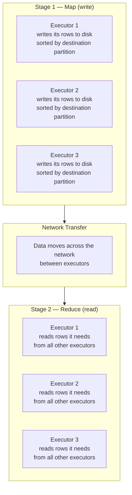
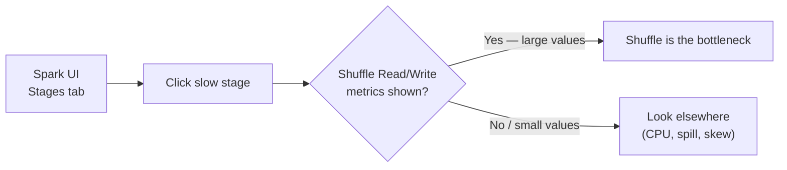
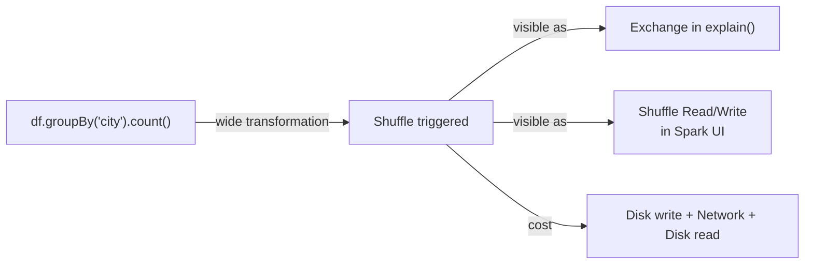

# Shuffle in Spark

## The single biggest cause of slow Spark jobs

Before getting into the definition — here's why shuffle matters. Every time a Spark job is slow for no obvious reason, shuffle is the first thing to check. Understanding it well means you'll know what's causing the slowness and what to do about it.

---

## What a shuffle is

Think of a classroom exam. 300 papers are distributed across 10 tables — 30 papers per table, randomly mixed. A teacher asks everyone to mark their own papers. Each person works independently on their own 30. That's a narrow transformation — no movement, fast.

Now the teacher says: "Sort all 300 papers by subject — science in one pile, maths in another, history in another."

Suddenly, papers have to physically move between tables. The person at table 1 has science, maths, and history mixed together. They need to send maths papers to the maths table, history papers to the history table, and keep only science. Every table is doing this simultaneously, sending and receiving papers across the room.

That movement of papers between tables — that is the shuffle.

In Spark: when an operation needs data from multiple partitions to produce its result, Spark has to physically move data across the network between executors. That movement is called a shuffle.

---

## What actually happens during a shuffle

A shuffle happens in two stages, and both are expensive.



**Stage 1 (Map):** Each executor sorts its data by destination and writes it to local disk. Not RAM — disk. This is the first cost.

**Transfer:** Executors read each other's output over the network. This is the second cost — and the slowest part. Network speed is much lower than RAM speed.

**Stage 2 (Reduce):** Each executor reads the data it received, sorts it again if needed, and processes it.

Shuffle = disk write + network transfer + disk read. Three expensive operations, every time.

---

## What triggers a shuffle

These operations always cause a shuffle:

| Operation | Why it shuffles |
|-----------|----------------|
| `groupBy()` | All rows for the same group key must land on the same executor |
| `join()` (non-broadcast) | Matching rows from both DataFrames must find each other |
| `orderBy()` / `sort()` | Global sort requires all data to be redistributed and sorted |
| `distinct()` / `dropDuplicates()` | Duplicates can span partitions — must compare globally |
| `repartition(n)` | Explicitly redistributes all data into n new partitions |
| `pivot()` | Requires grouping and aggregating across all partitions |

## What does NOT trigger a shuffle

These operations stay within each partition:

| Operation | Why it doesn't shuffle |
|-----------|----------------------|
| `filter()` / `where()` | Each partition filtered independently |
| `select()` | Columns dropped per partition — no movement |
| `withColumn()` | New column computed per row — stays local |
| `withColumnRenamed()` | Metadata change only |
| `drop()` | Column removed per partition |
| `limit(n)` | Takes n rows from available partitions |
| `coalesce(n)` | Merges adjacent partitions on the same executor — no network |

---

## Why shuffle is expensive — the three costs

### 1. Disk writes
Before data can move, executors write their output to local disk. RAM is fast. Disk is slow. On every shuffle, your data goes from RAM → disk → network → disk → RAM on the other side.

### 2. Network I/O
Data physically moves between machines. Network bandwidth is shared across the cluster. On a large job with many executors, all of them are sending and receiving simultaneously — the network becomes the bottleneck.

### 3. Re-partitioning
After the transfer, data needs to be reorganised into new partitions. This takes CPU and memory. If the new partitions are uneven (data skew — many rows going to one partition and few to others), some executors do all the work while others sit idle.

---

## How to spot a shuffle

### Method 1 — `explain()`

```python
df.groupBy("city").count().explain()
```

Look for `Exchange` in the output:

```
== Physical Plan ==
AdaptiveSparkPlan
+- HashAggregate
   +- Exchange hashpartitioning(city, 200)   ← shuffle here
      +- Scan parquet
```

Every `Exchange` in the physical plan is a shuffle. The `200` is the number of shuffle partitions Spark will create after the shuffle.

### Method 2 — Spark UI

Open the Spark UI and look at the Stage details for a slow job. You'll see:

- **Shuffle Write** — how much data each executor wrote to disk in Stage 1
- **Shuffle Read** — how much data each executor pulled over the network in Stage 2

Large shuffle read/write numbers = expensive shuffle. If shuffle read is in the GBs, that's where your time is going.



---

## The shuffle partition setting

After a shuffle, Spark creates new partitions. The default number is **200**, controlled by:

```python
spark.conf.set("spark.sql.shuffle.partitions", "200")  # default
```

200 partitions made sense for large clusters. On Databricks Free Edition with 2 workers, 200 shuffle partitions means 200 tiny tasks — most of them smaller than a few KB. This is overhead without benefit.

```python
# For small clusters or small data — reduce shuffle partitions
spark.conf.set("spark.sql.shuffle.partitions", "8")

# Then run your groupBy / join
df.groupBy("city").count().show()
```

A good starting point: set shuffle partitions to roughly 2–4× your number of cores. On Free Edition with 2 workers and 4 cores each = 8 cores → set to 8 or 16.

---

## How to reduce shuffles

### 1. Broadcast join — eliminate the shuffle entirely

When one side of a join is small (a few hundred rows to a few hundred MB), broadcast it. Spark sends a full copy to every executor — no shuffle needed.

```python
from pyspark.sql.functions import broadcast

# Without broadcast — both tables shuffle
df_result = df_transactions.join(df_state_codes, "state_code", "left")

# With broadcast — df_state_codes goes to every executor, no shuffle
df_result = df_transactions.join(broadcast(df_state_codes), "state_code", "left")
```

Real example: 10 crore transaction rows joined to a 500-row state codes table. Without broadcast, both tables shuffle — that's 10 crore rows moving across the network. With broadcast, the 500 rows get copied to every executor, and only the large table moves (to its own executors for processing). The 500-row copy is negligible.

### 2. Filter before you shuffle

The less data going into a shuffle, the cheaper it is. Push filters as early as possible — before any groupBy or join.

```python
# Worse — shuffle happens on all rows, then filter
df.groupBy("city").count().filter(col("city") == "Mumbai")

# Better — filter first, then shuffle only Mumbai rows
df.filter(col("city") == "Mumbai").groupBy("city").count()
```

Spark's optimizer often does this automatically (predicate pushdown), but being explicit never hurts.

### 3. Avoid unnecessary wide operations

`orderBy()` is a full global sort — one of the most expensive operations. If you only need the top N rows, use `limit()` after ordering, or better, use a window function. If you don't need a global sort at all, don't add one.

`distinct()` on a large DataFrame is expensive. If you know duplicates are rare, question whether you need it.

---

## Shuffle and the physical plan — the connection

Your class notes made this connection:

```
explain command → groupBy → Exchange (shuffle)
```

Now the full picture:



`groupBy` is a wide transformation → triggers a shuffle → `Exchange` appears in the physical plan → you see shuffle read/write metrics in the Spark UI. All four are describing the same thing at different levels.

---

## Summary

| Concept | One line |
|---------|----------|
| Shuffle | Data moving across the network between executors — caused by wide transformations |
| What causes it | groupBy, join (non-broadcast), orderBy, distinct, repartition |
| What doesn't | filter, select, withColumn, coalesce |
| Three costs | Disk write → network transfer → disk read |
| How to spot it | `Exchange` in `explain()`, shuffle read/write in Spark UI |
| How to reduce it | Broadcast join, filter early, avoid unnecessary orderBy/distinct |
| Shuffle partitions | Default 200 — reduce for small clusters (`spark.sql.shuffle.partitions`) |
