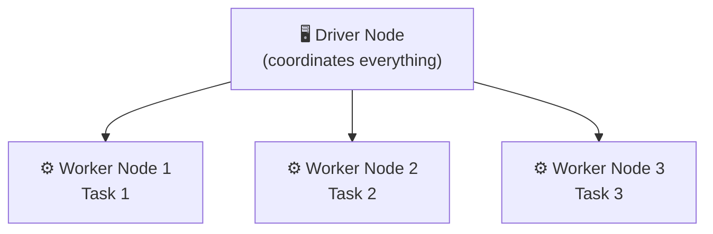
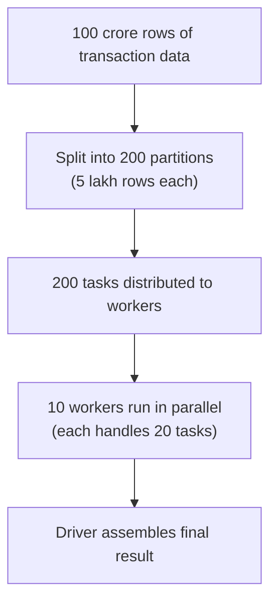
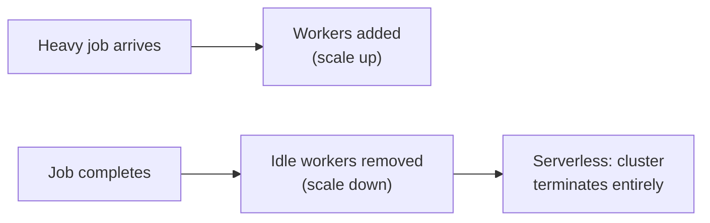
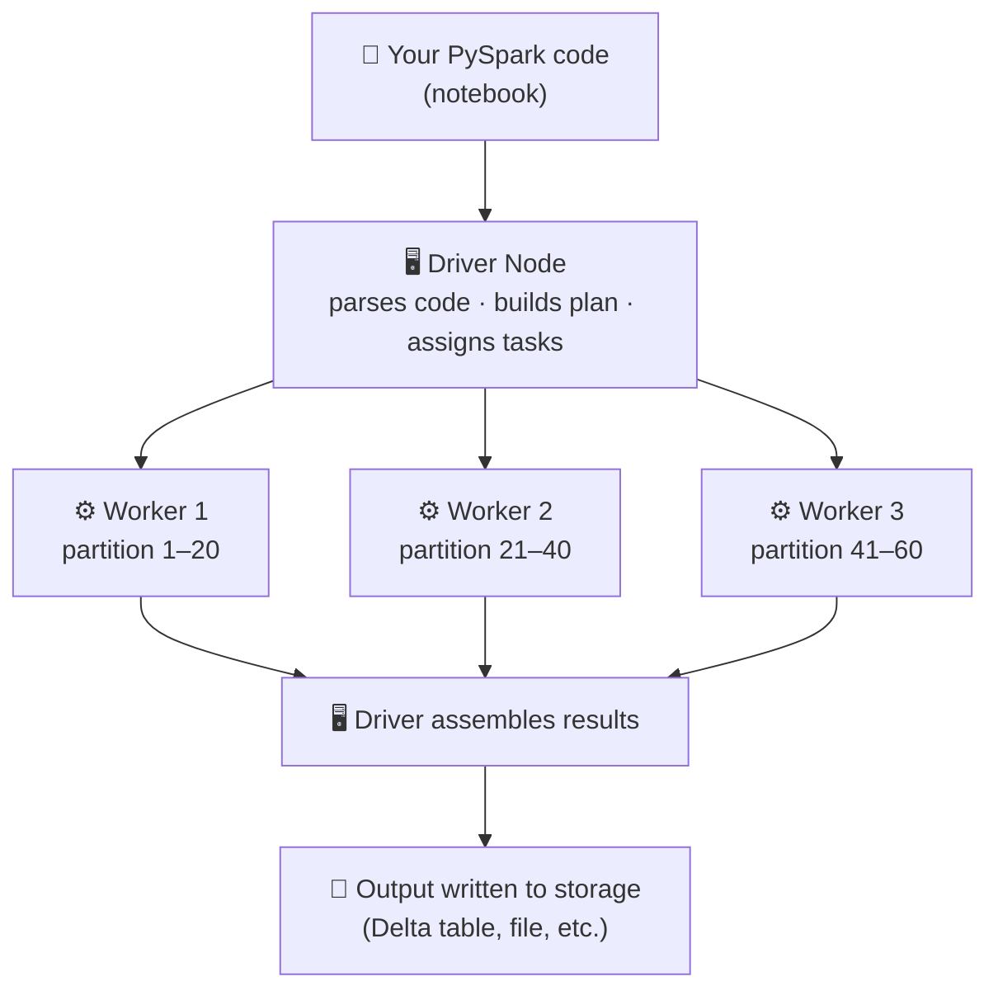

# How Spark Works — Architecture & Compute

## The one idea everything else builds on

Think about counting votes in a general election. One person counting 90 crore votes would take forever. So instead you have counting centers across every constituency — each center handles its local votes, and the final tally gets combined at the end.

That's distributed computing. Instead of one powerful machine doing all the work sequentially, you split the data across many machines, process in parallel, and combine the results. Spark is the engine that manages this entire operation.

---

## Spark Engine → Compute Engine

Spark is not a database. It does not store data. It is a **compute engine** — its only job is to process data that lives somewhere else (a data lake, cloud storage, Delta tables) and return results.

| | Database (e.g. SQL Server) | Spark |
|--|----------------------------|-------|
| Stores data? | Yes | No |
| Processes data? | Yes | Yes |
| Where data lives | On the same server | External storage (ADLS, S3, OneLake) |
| Scales how? | Bigger server | More machines in the cluster |

When you run a PySpark notebook on Databricks, you're not running code on your laptop. You're sending instructions to a Spark engine running on a cluster of machines in the cloud. Spark reads from storage, processes, and writes back to storage.

---

## Classic Compute vs Serverless Compute

There are two ways Spark compute is provisioned in Databricks.

### Classic Compute (Cluster you control)

You create a cluster manually. You choose how many machines, how much RAM, which Spark version. The cluster starts up (takes 3–5 minutes), runs until you stop it or it auto-terminates, and you're billed for every minute it's alive — whether it's actively processing data or sitting idle.

Think of it like renting an office. The office is yours from 9am to 6pm regardless of whether your team is working or not.


**You control:**
- Number of workers
- Machine type (memory/CPU)
- Auto-scaling rules
- Databricks Runtime version

**Use Classic when:**
- You need specific cluster configurations
- You're running long, continuous jobs
- You need to install custom libraries on the cluster

### Serverless Compute

No cluster to configure. You write your notebook, hit run, and Databricks figures out the compute. Behind the scenes it spins up resources, runs your code, and tears everything down when done. You pay only for the time your code is actually executing.


**Databricks manages:**
- Provisioning machines
- Scaling up and down
- Cluster configuration
- Teardown after job completes

**Use Serverless when:**
- You want zero cluster management
- You run intermittent jobs (not continuous)
- You're on a cost-sensitive setup (no idle billing)
- You're on Databricks Free Edition or a trial

The trade-off: serverless gives you less control over configuration. For learning and most standard pipelines, serverless is the better default.

---

## What is a Cluster?

A cluster is a group of machines that work together as one unit. When you submit a Spark job, it runs on the cluster.

Every cluster has two types of machines:



---

## Driver Node — the Tech Lead

The Driver is the coordinator. There is exactly one Driver per cluster. It:

- Receives your code (the PySpark instructions you write)
- Builds an execution plan (decides how to break the job into tasks)
- Assigns tasks to Worker nodes
- Monitors progress
- Collects and assembles the final result

The Driver does not process your data. It manages the workers who do.

If your class used the Tech Lead analogy — that's exactly right. The Tech Lead reads the requirements, breaks the work into tickets, assigns them to developers, reviews what comes back, and produces the final output. The Tech Lead doesn't write every line of code.

```python
# When you call .collect() or .show(), the Driver is what gets the result
# The heavy lifting happened on the workers
df.show()  # Driver asked workers → workers sent results back → Driver displays it
```

**What lives on the Driver:**
- Your PySpark application code
- The execution plan (DAG)
- Metadata and aggregated results

**What does NOT live on the Driver:**
- Your actual data (that's distributed across workers)

---

## Worker Nodes — the development team

Workers are the machines that actually process data. A cluster can have 2, 10, or 100+ workers depending on the workload. Each worker:

- Gets assigned a subset of the data (called a partition)
- Runs its task independently of other workers
- Sends results back to the Driver

Using the class analogy: the Driver (Tech Lead) gives each Worker (developer) a specific ticket to handle. The developer does their work independently and reports back. No worker waits for another worker to finish before starting.

---

## How tasks get distributed

When you run a Spark operation on a large DataFrame, Spark doesn't process the entire dataset in one go. It splits the data into **partitions** — chunks of rows. Each partition becomes a task, and each task goes to a worker.



You never write this split logic yourself — Spark handles it automatically. This is why PySpark is fast on large data: the work runs in parallel across all workers instead of sequentially on one machine.

---

## Scale Up vs Scale Down

A cluster can adjust the number of workers based on load.

| | What happens | When |
|--|--------------|------|
| **Scale up** | More workers are added to the cluster | Job is complex, queue of tasks is building up |
| **Scale down** | Workers are removed when they're idle | Job is finished or lighter, no point paying for idle machines |

In Classic Compute, you configure auto-scaling rules (min workers, max workers). In Serverless, Databricks handles all of this automatically — you don't set anything.



---

## Putting it all together



This is why PySpark code looks so different from regular Python. You're not writing instructions for one machine running top to bottom. You're writing a plan that Spark will execute in parallel across many machines, with the Driver coordinating everything.

---

## Classic vs Serverless — quick reference

| | Classic Compute | Serverless Compute |
|--|-----------------|-------------------|
| Cluster setup | Manual | Automatic |
| Startup time | 3–5 minutes | Near-instant |
| Scaling | Configure auto-scale rules | Automatic |
| Idle billing | Yes — cluster runs until stopped | No — pay only when executing |
| Config control | Full control | Limited |
| Best for | Custom configs, long-running jobs | Standard pipelines, learning, cost efficiency |
| Who manages infra | You | Databricks |
