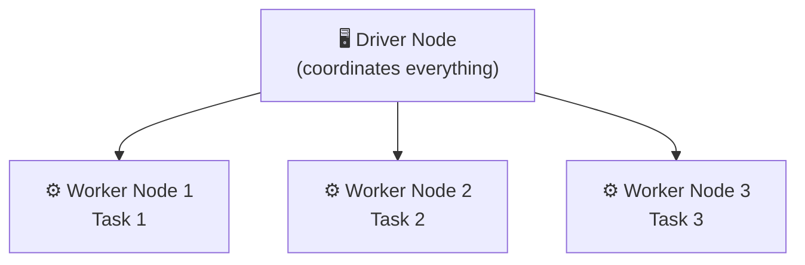
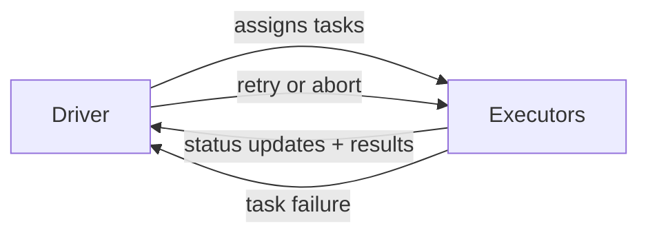
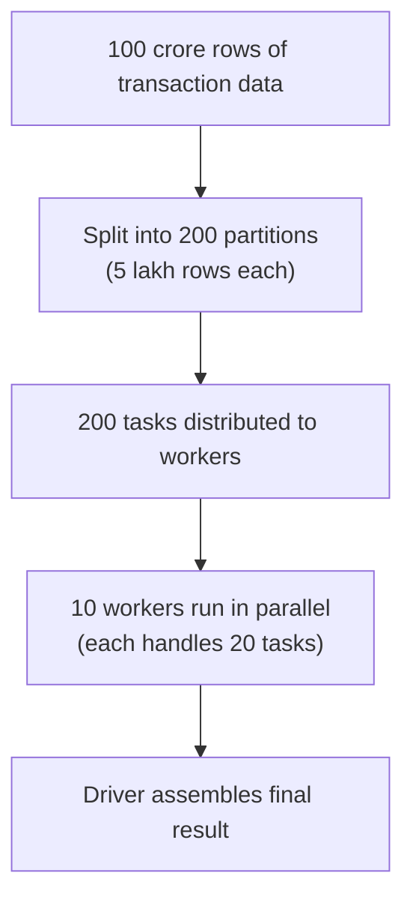
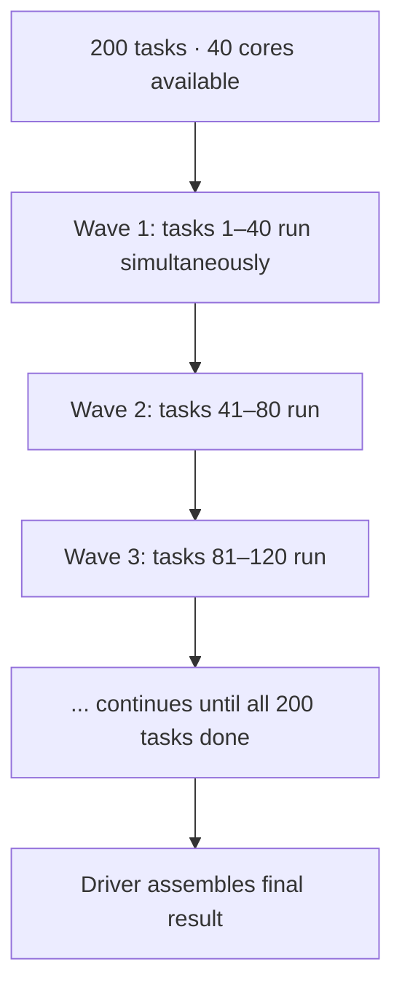
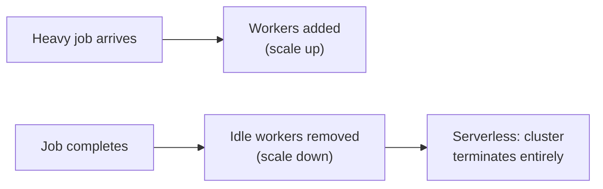
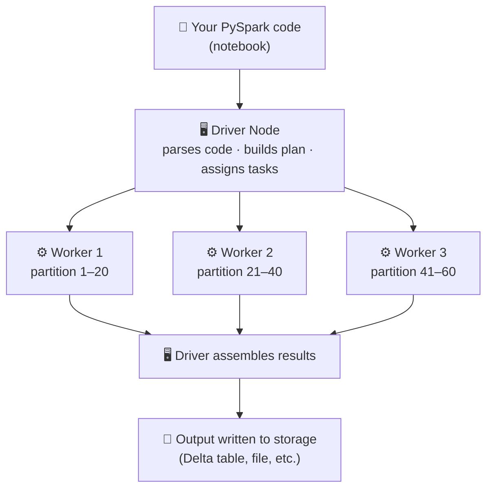

# How Spark Works — Architecture & Compute

## The one idea everything else builds on

Think about counting votes in a general election. One person counting 90 crore votes would take forever. So instead you have counting centers across every constituency — each center handles its local votes, and the final tally gets combined at the end.

That's distributed computing. Instead of one powerful machine doing all the work sequentially, you split the data across many machines, process in parallel, and combine the results. Spark is the engine that manages this entire operation.

---

## Spark Engine → Compute Engine

Spark is not a database. It does not store data. It is a **compute engine** — its only job is to process data that lives somewhere else (a data lake, cloud storage, Delta tables) and return results.

| | Database (e.g. SQL Server) | Spark |
|--|----------------------------|-------|
| Stores data? | Yes | No |
| Processes data? | Yes | Yes |
| Where data lives | On the same server | External storage (ADLS, S3, OneLake) |
| Scales how? | Bigger server | More machines in the cluster |

When you run a PySpark notebook on Databricks, you're not running code on your laptop. You're sending instructions to a Spark engine running on a cluster of machines in the cloud. Spark reads from storage, processes, and writes back to storage.

---

## Classic Compute vs Serverless Compute

There are two ways Spark compute is provisioned in Databricks.

### Classic Compute (Cluster you control)

You create a cluster manually. You choose how many machines, how much RAM, which Spark version. The cluster starts up (takes 3–5 minutes), runs until you stop it or it auto-terminates, and you're billed for every minute it's alive — whether it's actively processing data or sitting idle.

Think of it like renting an office. The office is yours from 9am to 6pm regardless of whether your team is working or not.


**You control:**
- Number of workers
- Machine type (memory/CPU)
- Auto-scaling rules
- Databricks Runtime version

**Use Classic when:**
- You need specific cluster configurations
- You're running long, continuous jobs
- You need to install custom libraries on the cluster

### Serverless Compute

No cluster to configure. You write your notebook, hit run, and Databricks figures out the compute. Behind the scenes it spins up resources, runs your code, and tears everything down when done. You pay only for the time your code is actually executing.


**Databricks manages:**
- Provisioning machines
- Scaling up and down
- Cluster configuration
- Teardown after job completes

**Use Serverless when:**
- You want zero cluster management
- You run intermittent jobs (not continuous)
- You're on a cost-sensitive setup (no idle billing)
- You're on Databricks Free Edition or a trial

The trade-off: serverless gives you less control over configuration. For learning and most standard pipelines, serverless is the better default.

---

## What is a Cluster?

A cluster is a group of machines that work together as one unit. When you submit a Spark job, it runs on the cluster.

Every cluster has two types of machines:



---

## Driver Node — the Tech Lead

The Driver is the coordinator. There is exactly one Driver per cluster. It:

- Receives your code (the PySpark instructions you write)
- Builds an execution plan (decides how to break the job into tasks)
- Assigns tasks to Worker nodes
- Monitors progress
- Collects and assembles the final result

The Driver does not process your data. It manages the workers who do.

If your class used the Tech Lead analogy — that's exactly right. The Tech Lead reads the requirements, breaks the work into tickets, assigns them to developers, reviews what comes back, and produces the final output. The Tech Lead doesn't write every line of code.

```python
# When you call .collect() or .show(), the Driver is what gets the result
# The heavy lifting happened on the workers
df.show()  # Driver asked workers → workers sent results back → Driver displays it
```

**What lives on the Driver:**
- Your PySpark application code
- The execution plan (DAG)
- Metadata and aggregated results

**What does NOT live on the Driver:**
- Your actual data (that's distributed across workers)

---

## Worker Nodes — the development team

Workers are the machines in the cluster. A cluster can have 2, 10, or 100+ workers depending on the workload. Each worker:

- Gets assigned a subset of the data (called a partition)
- Reads files from storage
- Runs transformations on its partition
- Writes output directly to storage (Delta table, parquet, etc.)
- Works in parallel with all other workers
- Sends results or metadata back to the Driver when done

Using the class analogy: the Driver (Tech Lead) gives each Worker (developer) a specific ticket to handle. The developer does their work independently and reports back. No worker waits for another worker to finish before starting.

One important point on "Write Output": when your job writes a Delta table or parquet file, the Executors write directly to storage in parallel — they don't send data back to the Driver first. The Driver only receives a success/failure confirmation, not the actual data. This is what makes large writes fast.

---

## Executor — the process that actually runs your code

There are two things on every worker machine, and it's worth being precise about both.

- **Worker Node** — the physical machine. It provides CPU, RAM, disk, and network. It knows nothing about Spark.
- **Executor** — a Spark process that runs on the worker node. This is what reads partitions, runs tasks, and sends results back to the Driver.

The Worker Node is the office building. The Executor is the employee working inside it. The building provides space and power — the employee does the work.

```
Worker Node (the machine)
└── Executor (Spark process)
    ├── Task 1 → processes partition 1
    ├── Task 2 → processes partition 2
    └── Task 3 → processes partition 3
```

Each executor can run multiple tasks simultaneously — one per CPU core. An executor with 4 cores runs 4 tasks in parallel.

Executors:
- Hold data in memory while processing
- Write to disk if memory runs out (spill)
- Send results back to the Driver when done

In the Spark UI and in error logs, "executor" appears constantly. Now you know exactly what it refers to.

---

## Core, Parallelism, and MPP

A **core** is a CPU slot on an executor. One core runs one task at a time.

If an executor has 4 cores, it runs 4 tasks simultaneously. 10 executors × 4 cores = 40 tasks running in parallel across the cluster.

```
10 executors × 4 cores = 40 parallel tasks
200 partitions ÷ 40 cores = 5 waves to complete the job
```

This is what **Massively Parallel Processing (MPP)** means in practice. Large data gets split into many partitions. Each partition becomes a task. Tasks run simultaneously across all available cores. More cores = faster job.

| Term | What it means |
|------|--------------|
| Core | One CPU slot — runs one task at a time |
| Parallelism | Number of tasks running simultaneously across all cores |
| MPP | Processing large data by splitting into partitions and running them in parallel |

The cluster sizing question — "how many workers do I need?" — comes down to: how many cores do I need running in parallel to finish this job in an acceptable time?

---

## How Executors and the Driver communicate

The Driver doesn't just hand out tasks and forget. There's constant back-and-forth:

- Driver assigns tasks to Executors
- Executors send status updates back to the Driver as tasks run
- When a task completes, the Executor sends results back to the Driver
- If a task fails, the Executor reports the failure — the Driver decides whether to retry



This communication happens over the network. It's also why the Driver should never do heavy computation itself — it's too busy coordinating.

---

## How tasks get distributed

When you run a Spark operation on a large DataFrame, Spark doesn't process the entire dataset in one go. It splits the data into **partitions** — chunks of rows. Each partition becomes a task, and each task goes to a worker.



You never write this split logic yourself — Spark handles it automatically. This is why PySpark is fast on large data: the work runs in parallel across all workers instead of sequentially on one machine.

---

## Task Scheduling — how tasks run in waves

When a Job has more tasks than available cores, Spark doesn't wait for everything to be ready. It schedules in **waves** — the first batch fills all available cores, and as each task completes, the next one is immediately assigned.



This is why adding more cores (bigger cluster) speeds up a job — each wave processes more tasks, so fewer waves are needed to finish.

The Driver manages this scheduling. It tracks which executors are free and assigns the next task as soon as a core becomes available. You can see each wave in the Spark UI as a set of tasks running at the same time.

---

## Scale Up vs Scale Down

A cluster can adjust the number of workers based on load.

| | What happens | When |
|--|--------------|------|
| **Scale up** | More workers are added to the cluster | Job is complex, queue of tasks is building up |
| **Scale down** | Workers are removed when they're idle | Job is finished or lighter, no point paying for idle machines |

In Classic Compute, you configure auto-scaling rules (min workers, max workers). In Serverless, Databricks handles all of this automatically — you don't set anything.



---

## Putting it all together



This is why PySpark code looks so different from regular Python. You're not writing instructions for one machine running top to bottom. You're writing a plan that Spark will execute in parallel across many machines, with the Driver coordinating everything.

---

## Tungsten Engine — how standard Spark manages memory

Before Photon existed, Apache Spark used the Tungsten execution engine to handle memory and CPU efficiency on the JVM.

The JVM manages memory through a process called garbage collection (GC). Periodically, the JVM stops all processing, scans everything in memory, frees what's no longer needed, and then resumes. This is called a GC pause. On a cluster processing large data, these pauses can be seconds long — your job is running, then everything freezes, then it resumes.

Tungsten was Spark's answer to this. It manages memory directly outside the JVM heap — called **off-heap memory** — in a region the GC never touches. No GC involvement means no GC pauses.

```
JVM Heap (on-heap)        Off-heap memory
├── your code             ├── Tungsten data storage
├── JVM objects           ├── shuffle buffers
└── GC tracks all of it   └── GC never sees this
```

Tungsten also generates optimised bytecode at runtime for specific queries rather than using generic interpreted code — faster CPU execution.

Understanding Tungsten matters because off-heap memory is still bounded. When you broadcast a table to every executor, that copy sits in memory. If the table is too large, the executor runs out of memory and the job fails — not slows, fails.

---

## Photon Engine — Databricks' native execution layer

When you open the Spark UI or look at a physical plan in Databricks, you'll see references to **Photon**. This is Databricks' own query engine that sits underneath your PySpark code.

Standard Apache Spark runs on the JVM and uses Tungsten for memory management. Photon goes further — it is rewritten entirely in C++, which manages memory directly at the OS level with no JVM involved at all. It processes data in column-batches rather than row by row.

```
Your PySpark code
      ↓
Databricks Runtime
      ↓
Photon Engine (C++)   ← replaces standard Spark JVM execution
      ↓
Results
```

**What this means for you:**

- You write nothing differently — same PySpark code, same DataFrame API
- Photon runs automatically when available. No configuration needed.
- In the Spark UI, operations show as "Photon" or fall back to standard Spark labels — you can see per-operation which engine ran it
- Not every operation uses Photon — Python UDFs and some streaming operations fall back to standard Spark

**Photon vs Tungsten:**

| | Tungsten | Photon |
|--|----------|--------|
| Language | JVM (Java/Scala) | C++ |
| Memory | Off-heap via Unsafe API | Direct OS memory |
| GC pauses | Eliminated via off-heap | No JVM — no GC at all |
| Processing | Row-based | Columnar batches |
| Where | Standard Apache Spark | Databricks only |

On Databricks with Photon enabled, Photon replaces Tungsten's execution. The off-heap memory concern still applies — executor memory is still finite — but Photon handles it more efficiently than Tungsten did.

**Why it matters:**

If you're comparing job times between Databricks and another Spark environment, Photon is part of why Databricks is faster. It's not a Spark improvement — it's a Databricks layer on top.

Available on Databricks Runtime 9.1+ including Free Edition on compatible cluster types.

---

## Classic vs Serverless — quick reference

| | Classic Compute | Serverless Compute |
|--|-----------------|-------------------|
| Cluster setup | Manual | Automatic |
| Startup time | 3–5 minutes | Near-instant |
| Scaling | Configure auto-scale rules | Automatic |
| Idle billing | Yes — cluster runs until stopped | No — pay only when executing |
| Config control | Full control | Limited |
| Best for | Custom configs, long-running jobs | Standard pipelines, learning, cost efficiency |
| Who manages infra | You | Databricks |
