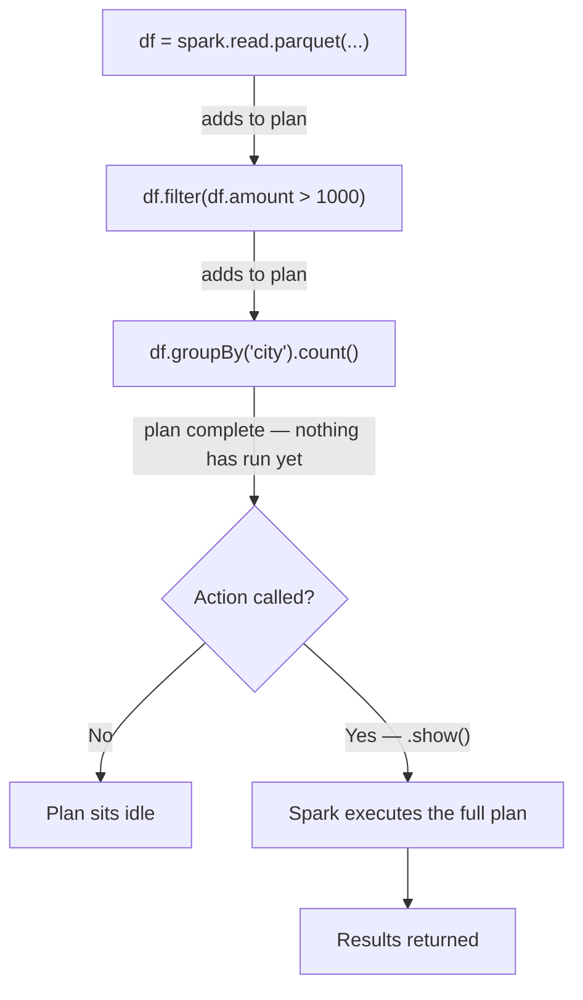
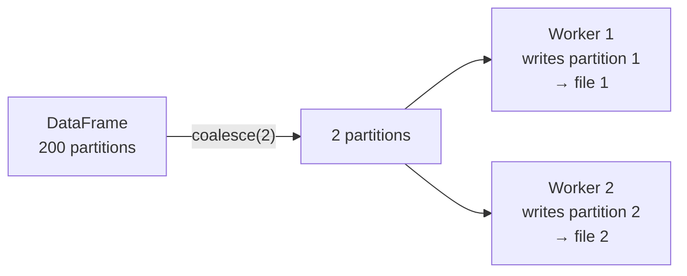
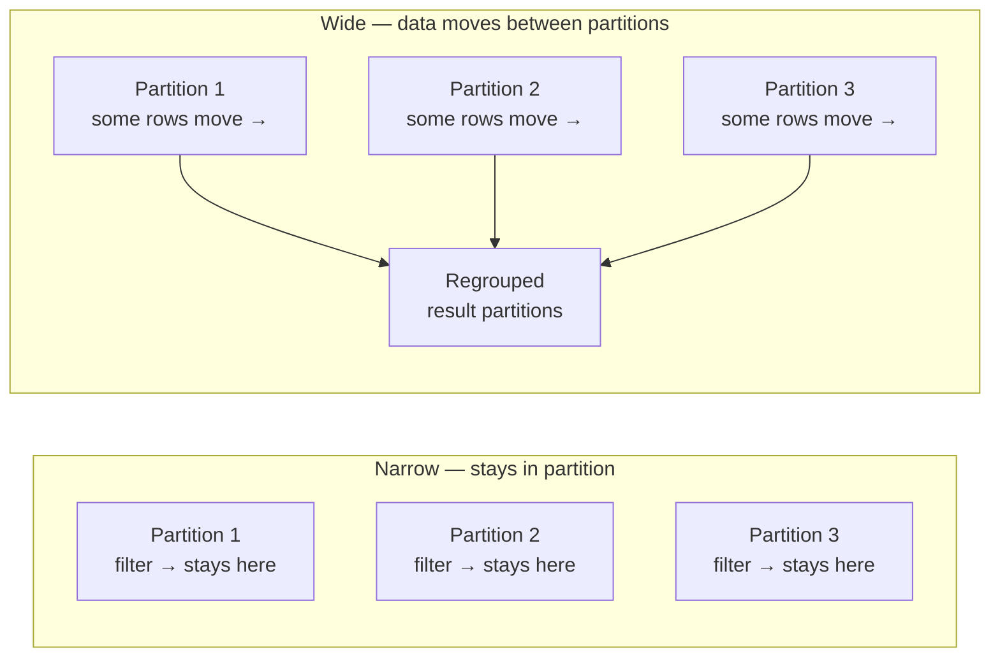
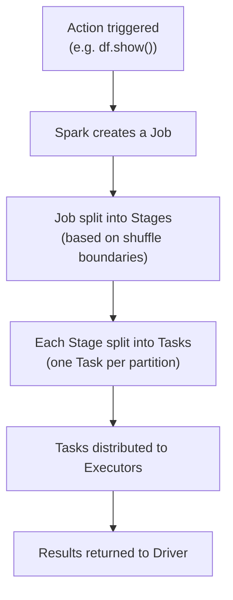
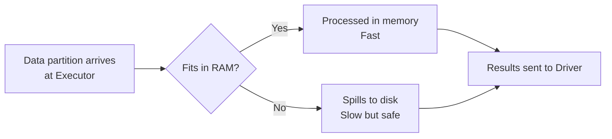

# How Spark Executes Your Code

## Before you write a single line of PySpark

Every PySpark program starts the same way:

```python
from pyspark.sql import SparkSession

spark = SparkSession.builder.appName("MyApp").getOrCreate()
```

This one line creates the `SparkSession`. Until you do this, Spark doesn't exist in your program. No connection to the cluster, no ability to read data, no ability to run anything.

Think of it like switching on your laptop before you can open any files. The laptop is the cluster — always there. SparkSession is the power button that connects your code to it.

`spark` is the variable name by convention. Every DataFrame operation you write — `spark.read`, `spark.sql`, `df.filter` — flows through this object.

In Databricks, the session is created for you automatically. You don't need to write this line in a notebook. It's already running as `spark`. If you ever see it in someone else's code, now you know what it is.

---

## SparkContext — what's inside SparkSession

You'll see `SparkContext` in error messages and older code. It's the lower-level object that SparkSession wraps internally.

```python
# SparkSession is what you use
spark = SparkSession.builder.appName("MyApp").getOrCreate()

# SparkContext is what's inside it — accessible if you need it
sc = spark.sparkContext
```

SparkContext was the original entry point before Spark 2.0. SparkSession replaced it as a single unified entry point covering DataFrames, SQL, and streaming. You don't create a SparkContext yourself anymore — SparkSession handles that for you.

When you see errors like `SparkContext already stopped` or `Cannot run multiple SparkContexts`, it means the underlying context was shut down or a duplicate was attempted. In Databricks this rarely happens, but knowing what SparkContext is makes those errors readable.

---

## Why nothing runs when you write a transformation

Write this in a notebook:

```python
df = spark.read.parquet("/data/transactions")
df_filtered = df.filter(df.amount > 1000)
df_grouped = df_filtered.groupBy("city").count()
```

Run it. Nothing happens. No data was read. No filtering ran. No grouping ran.

That's lazy evaluation.

Spark doesn't execute anything when you write transformations. It just builds a plan — a list of "here's what I want to do". The plan stays as a plan until you ask for a result.

The grocery list analogy: you can write 50 items on a list — rice, dal, vegetables, snacks — and it costs you nothing. No time, no effort. The work only happens when you go to the shop. In Spark, writing transformations is making the list. Calling an action is going to the shop.



Why does Spark do this? Because it can look at the whole plan and optimise before running anything. If you filter early and join late, Spark might reorder operations to be more efficient. It can only do that if it sees the full picture first.

---

## Transformations vs Actions

Every operation in PySpark is one of two things.

### How to tell which is which

**Rule 1 — what does it return?**

- Returns a DataFrame → Transformation
- Returns a Python value (number, list, row) or writes to storage → Action

**Rule 2 — the chain test:**

Can you put another `.filter()` after it?

```python
df.filter(...).filter(...)   # works — both transformations, both return DataFrames
df.count().filter(...)       # fails — count() returns an int, not a DataFrame
```

If you can chain it, it's a transformation. If the result is something you'd print or save, it's an action.

---

### Transformations — narrow (no data movement)

These stay within each partition. Fast, no network cost.

| Operation | What it does |
|-----------|-------------|
| `.filter()` / `.where()` | Keep rows that match a condition |
| `.select()` | Choose which columns to keep |
| `.withColumn()` | Add or modify a column |
| `.withColumnRenamed()` | Rename a column |
| `.drop()` | Remove a column |
| `.cast()` | Change a column's data type |
| `.alias()` | Give a column or DataFrame a new name |
| `.limit(n)` | Keep only the first n rows |
| `.na.fill()` | Replace nulls with a value |
| `.na.drop()` | Drop rows containing nulls |
| `.dropna()` | Same as `na.drop()` |
| `.fillna()` | Same as `na.fill()` |
| `.coalesce(n)` | Reduce partition count without a shuffle |
| `.union()` / `.unionByName()` | Stack two DataFrames vertically |

### Transformations — wide (causes a shuffle)

These require data to move across partitions. Slower — use sparingly.

| Operation | What it does |
|-----------|-------------|
| `.groupBy()` | Group rows by one or more columns |
| `.agg()` | Aggregate after groupBy (sum, avg, max, etc.) |
| `.orderBy()` / `.sort()` | Sort all rows — requires global shuffle |
| `.join()` | Join two DataFrames (non-broadcast) |
| `.distinct()` | Remove duplicate rows — requires shuffle |
| `.dropDuplicates()` | Remove duplicates by specific columns |
| `.repartition(n)` | Redistribute data into n partitions — always shuffles |
| `.pivot()` | Pivot a column into multiple columns |
| `.crossJoin()` | Cartesian join — every row × every row |

### Actions — trigger execution

These run the plan and return a result. Each one creates a new Job.

| Operation | Returns | What it does |
|-----------|---------|-------------|
| `.show(n)` | Nothing (prints) | Prints first n rows to screen (default 20) |
| `.count()` | Integer | Total number of rows |
| `.collect()` | List of Rows | Pulls all data to the Driver — careful on large tables |
| `.take(n)` | List of Rows | Returns first n rows as a Python list |
| `.first()` | Single Row | Returns the very first row |
| `.head(n)` | List of Rows | Same as `take(n)` |
| `.toPandas()` | Pandas DataFrame | Converts to pandas — pulls all data to Driver |
| `.write.parquet()` | Nothing | Writes to parquet files |
| `.write.csv()` | Nothing | Writes to CSV files |
| `.write.format().save()` | Nothing | Writes to any format (Delta, JSON, etc.) |
| `.saveAsTable()` | Nothing | Saves as a Delta table in the catalog |
| `.explain()` | Nothing (prints) | Prints the physical execution plan |

---

### Edge cases worth knowing

**`.limit(n)`** looks like it should run immediately (you're asking for specific rows), but it's a transformation — it returns a DataFrame and nothing executes until an action is called.

**`.coalesce(n)`** — see the dedicated section below for full details and the Databricks Free Edition use case.

**`.cache()` / `.persist()`** — neither a transformation nor an action. It marks the DataFrame for caching, but the cache only fills when an action runs. Nothing happens at the point you call `.cache()`.

**`.distinct()`** is wide (causes a shuffle) even though it doesn't feel like it should. To find duplicates across 200 partitions, Spark has to shuffle all rows to compare them globally.

---

```python
df_filtered = df.filter(df.amount > 1000)   # transformation — plan updated, nothing runs
df_filtered.show()                            # action — plan executes NOW

row_count = df_filtered.count()              # action — returns an int
print(row_count)                             # 42381
```

---

## Controlling partitions with `coalesce`

One thing that often isn't obvious: **each partition becomes a separate output file when you write data.**

```python
df_result.write.parquet("/output/transactions")
```

If the DataFrame has 200 partitions, that write creates 200 parquet files. On Databricks Free Edition with limited workers, this is excessive — tiny files, hard to inspect, and harder to reason about.

`coalesce(n)` reduces the number of partitions before writing, without causing a shuffle.

```python
# Check current partition count
print(df_result.rdd.getNumPartitions())   # e.g. 8

# Coalesce to 2 partitions before writing → creates 2 output files
df_result.coalesce(2).write.parquet("/output/transactions")

# Coalesce to 1 → single clean output file, easiest to inspect
df_result.coalesce(1).write.parquet("/output/transactions")
```

### Why it doesn't shuffle

`coalesce` merges adjacent partitions on the same worker. Partition 1 and Partition 2 sitting on Worker A get combined into one — no data crosses the network. That's what makes it a narrow transformation.

`repartition(n)` does the opposite — it redistributes data evenly across n partitions via a full shuffle. Slower, but gives you balanced partition sizes.

| | `coalesce(n)` | `repartition(n)` |
|--|--------------|-----------------|
| Shuffles? | No | Yes — full network redistribution |
| Can increase partitions? | No | Yes |
| Partition balance | Uneven (merges nearby) | Even (redistributes globally) |
| Use when | Reducing for output | Rebalancing for better parallelism |

### Why production pipelines use coalesce before writes

Spark decides partition count to maximise compute parallelism — more partitions means more tasks running in parallel, which is the right call during processing. But when you write output, each partition becomes a file. 200 shuffle partitions means 200 output files — tiny files that are slow to read downstream, expensive on cloud storage (more API calls per read), and hard to work with. In production pipelines, coalesce before a write is standard practice specifically to control output file count. The partition count that was right for compute is often wrong for storage.

### The Databricks Free Edition use case

In Free Edition with limited workers, your trainer explicitly used `coalesce` to demonstrate distributed computing — making it visible how many partitions exist and which worker handles which chunk.

```python
# Read data — Spark decides partition count automatically
df_transactions = spark.read.parquet("/data/transactions")
print(f"Partitions after read: {df_transactions.rdd.getNumPartitions()}")

# Explicitly set partitions to match your worker count
df_result = df_transactions \
    .filter(df_transactions.amount > 1000) \
    .coalesce(2)   # 2 workers in Free Edition → 2 partitions

print(f"Partitions after coalesce: {df_result.rdd.getNumPartitions()}")  # 2

# Each worker now writes one file
df_result.write.parquet("/output/filtered_transactions")
```



The partition count directly controls the number of output files. `coalesce(2)` on 2 workers means each worker writes exactly one file — clean, predictable, and easy to see how work is divided across the cluster.

One practical thing to know: every `.count()` and every `.show()` triggers a full execution of everything upstream. If you call `.count()` three times on the same DataFrame, Spark runs the full plan three times. If you need to reuse a result, cache it — but that's a performance topic for later.

---

## Narrow vs Wide Transformations

Not all transformations are equal. There are two types, and the difference determines whether your job is fast or slow.

### Narrow transformation

Every row in the output comes from exactly one partition. No data needs to move across the network. Each partition is processed independently.

Think of it like marking exam papers. You have 100 papers split across 10 tables — 10 papers per table. Each person marks their own 10 papers. No paper moves between tables. That's a narrow transformation.

Examples: `filter`, `select`, `withColumn`, `drop`

```python
# Narrow — each partition processed independently, no data movement
df.filter(df.amount > 1000)
df.select("city", "amount")
df.withColumn("tax", df.amount * 0.18)
```

### Wide transformation

Output rows may need data from multiple partitions. Spark has to redistribute data across the network before it can produce the result. This redistribution is called a **shuffle**.

Same exam analogy — now you need to sort all 100 papers by subject. Science papers, maths papers, and history papers are mixed across all 10 tables. To group them, papers have to physically move between tables. That movement is the shuffle.

Examples: `groupBy`, `join` (non-broadcast), `orderBy`, `distinct`

```python
# Wide — rows from all partitions must be redistributed to group by city
df.groupBy("city").count()

# Wide — rows from both DataFrames need to find their match across the cluster
df.join(df2, "id", "left")
```



The shuffle is the expensive part. Moving data across the network takes time — much more than processing it in place. This is exactly why broadcast join exists: by sending the small table to every partition, you avoid the shuffle entirely.

Shuffle is a big enough concept that it has its own detailed page coming — covering what it costs, how to spot it, and how to reduce it.

---

## The `explain()` command — reading the physical plan

Before Spark runs anything, it builds a physical plan — the exact steps it will take to execute your query. You can see this plan by calling `.explain()`.

```python
df.groupBy("city").count().explain()
```

Output (simplified):
```
== Physical Plan ==
AdaptiveSparkPlan
+- HashAggregate
   +- Exchange hashpartitioning(city)   ← this is the shuffle
      +- Scan parquet
```

The `Exchange` step is the shuffle. Whenever you see `Exchange` in the physical plan, data is moving across the network between partitions.

This is the connection from your class notes: physical plan → groupBy → shuffle. `groupBy` is a wide transformation, which forces a shuffle (`Exchange`), which you can see in the plan.

```python
# Narrow — no Exchange in the plan
df.filter(df.amount > 1000).explain()

# Wide — Exchange appears because data must be redistributed
df.groupBy("city").count().explain()
```

`.explain()` is your first debugging tool when a job runs slow. If you see more `Exchange` steps than expected, you have more shuffles than needed — and that's where the time is going.

---

## What the optimizer does automatically

Before running anything, Spark's Catalyst optimizer looks at your plan and applies transformations to make it faster. Two of the most impactful are visible in every physical plan.

### Predicate pushdown

A predicate is a filter condition — `ville = Paris`, `Heart_Rate > 100`, `status = active`. Spark pushes these as close to the data source as possible — ideally into the file scan itself.

Think of it like searching for a specific file in a cabinet. Instead of pulling every file out and reading each one, you read the folder labels first and only pull the relevant folder. The irrelevant files never leave the cabinet.

Without predicate pushdown: all rows load into memory, filter runs after.
With predicate pushdown: the data source is told to return only matching rows. Non-matching rows never enter memory.

Visible in the physical plan as `PushedFilters` on the `FileScan` node:

```
FileScan csv [...] PushedFilters: [IsNotNull(ville), EqualTo(ville,Paris)]
```

When `PushedFilters` is empty, there was no filter to push — or the source format doesn't support it.

Note that Spark also automatically adds `IsNotNull` alongside your filter — it won't attempt to match null values against a string condition.

### Column pruning

The column equivalent of predicate pushdown. If your query only needs `ville` and `Heart_Rate`, Spark reads only those two columns at the source — even if the file has 20 others. The unused columns never enter memory.

Visible in the `FileScan` node — it only lists the columns it actually needs:

```
FileScan csv [ville#13186, Heart_Rate#13187]
```

Both optimisations happen automatically. You write the query clearly — the optimizer handles reducing the data volume before any processing begins.

---

## What is a Job?

Every time an action fires, Spark creates a **Job**.

One action = one Job. Three `.show()` calls in your notebook = three Jobs.

Each Job is broken down further into Stages and Tasks:



You can see all of this in the Spark UI — every Job, every Stage, every Task, how long each one took. When a job is slow, the UI tells you exactly where the time went.

For now, the key point: an action creates a Job. Jobs are what Spark actually runs on the cluster.

---

## Why Spark is fast — and when it isn't

### In-memory processing

Spark keeps data in RAM as much as possible. RAM is many times faster than reading from disk. A filter on 10 crore rows that runs in memory completes in seconds. The same filter reading from disk every time would take minutes.

This is the core reason Spark is fast on large data — it minimises disk reads by holding intermediate results in memory across operations.

### Spill to disk

If the data doesn't fit in RAM — because a partition is too large, or the executor doesn't have enough memory — Spark writes the overflow to local disk on the worker node. It processes from disk, then cleans up.

Spill doesn't crash your job. It just slows it down. You'll see it in the Spark UI as "spill (memory)" and "spill (disk)" in the task details.



When you see a job that runs slowly despite having enough workers, spill is a common reason. The fix is either increasing executor memory or reducing partition size — both are tuning topics.

---

## Summary

| Concept | One line |
|---------|----------|
| SparkSession | The connection between your code and the cluster — must exist before anything runs |
| SparkContext | The lower-level object inside SparkSession — you don't create it directly |
| Lazy evaluation | Transformations build a plan; nothing executes until an action is called |
| Transformation | Returns a DataFrame — filter, select, join, withColumn — adds to the plan |
| Action | Produces a result or writes output — show, count, collect, write — triggers execution |
| Narrow transformation | Stays within one partition — no data movement, fast (filter, select, withColumn) |
| Wide transformation | Data moves across partitions — causes a shuffle, slower (groupBy, join, orderBy) |
| Shuffle | Network movement of data between partitions caused by wide transformations |
| `explain()` | Shows the physical plan — look for `Exchange` to find shuffles |
| `explain(True)` | Shows all three stages: unresolved logical, optimised logical, physical |
| Predicate pushdown | Optimizer pushes filters to the data source — non-matching rows never enter memory |
| Column pruning | Optimizer drops unused columns at read time — only needed columns are loaded |
| `coalesce(n)` | Reduces partition count without shuffling — controls number of output files |
| `repartition(n)` | Redistributes data evenly into n partitions — causes a shuffle |
| Job | Created when an action fires — one action = one Job |
| In-memory processing | Spark holds data in RAM for speed |
| Spill to disk | When RAM runs out — job slows down but doesn't fail |
